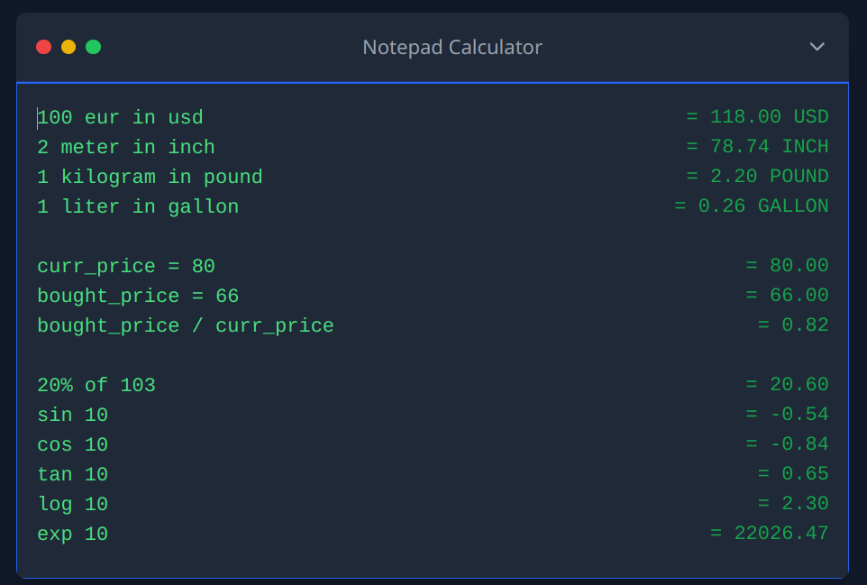

# Notepad Calculator Documentation

## Supported Inputs

### Variable Assignments
- **Syntax:** `variable = value`
- **Example:** `a = 2`

### Basic Arithmetic
- **Addition:** `a + 3`
- **Subtraction:** `5 - 2`
- **Multiplication:** `4 * 3` or `4 times 3`
- **Division:** `8 / 2`

### Currency Conversions
- **Syntax:** `amount from_currency in to_currency`
- **Example:** `10 USD in EUR`
- **Supported Currencies:** USD, EUR, GBP

### Length Conversions
- **Syntax:** `amount from_unit in to_unit`
- **Example:** `1 meter in inch`
- **Supported Units:** meter, kilometer, centimeter, millimeter, inch, foot

### Weight Conversions
- **Syntax:** `amount from_unit in to_unit`
- **Example:** `1 kilogram in pound`
- **Supported Units:** kilogram, gram, milligram, pound, ounce

### Volume Conversions
- **Syntax:** `amount from_unit in to_unit`
- **Example:** `1 liter in gallon`
- **Supported Units:** liter, milliliter, cubic_meter, gallon, quart

### Percentage Calculations
- **Syntax:** `percentage% of value`
- **Example:** `20% of 50`

### Simple Number or Currency
- **Syntax:** `value`
- **Example:** `100`

### Trigonometric Functions
- **Syntax:** `function value`
- **Example:** `sin 30`
- **Supported Functions:** sin, cos, tan

### Logarithmic Functions
- **Syntax:** `log value`
- **Example:** `log 10`

### Exponential Functions
- **Syntax:** `exp value`
- **Example:** `exp 2`